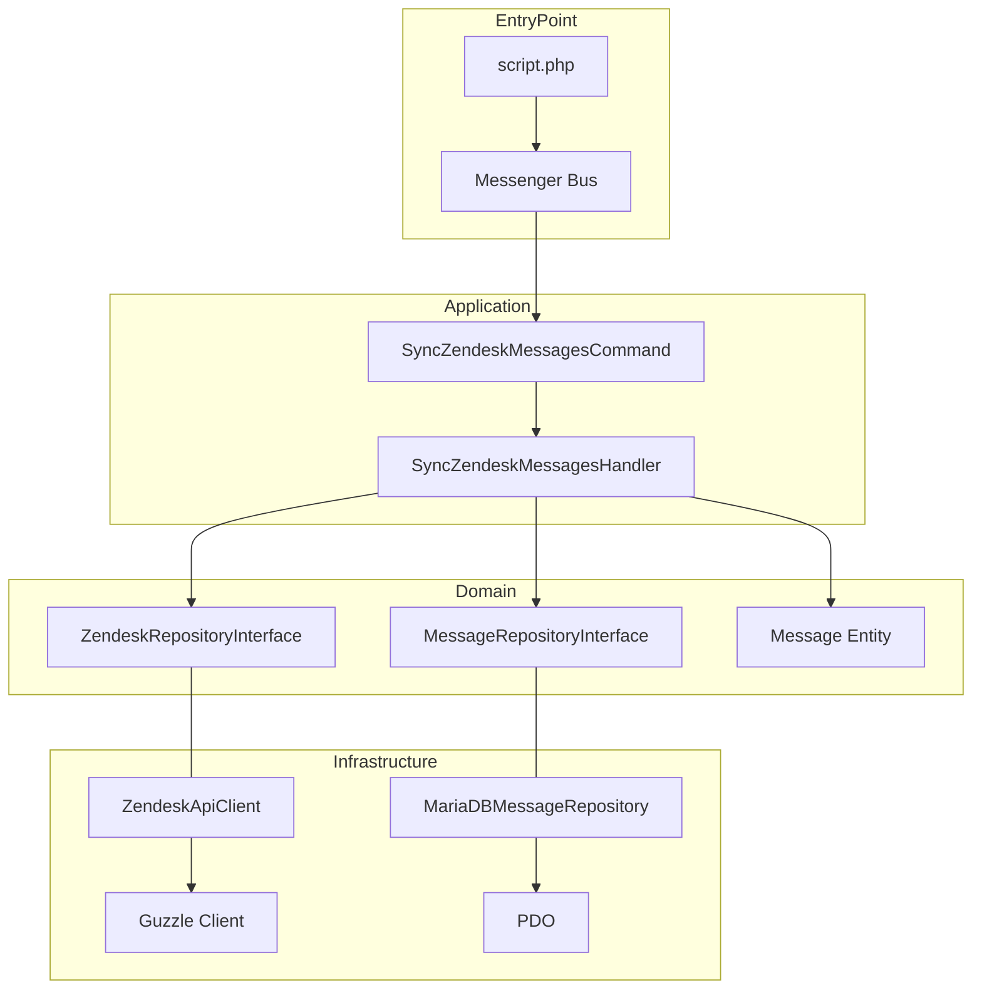

# Documentation Technique - Zendesk Integration Service

Cette documentation est destinée aux équipes techniques pour l'intégration, la maintenance et l'évolution du service de synchronisation Zendesk.

## 1. Stack Technique & Patterns

- **PHP 8.2+** (Typage strict activé)
- **Hexagonal Architecture** : Découplage strict entre la logique métier (Domain/Application) et les drivers/adpateurs (Infrastructure).
- **CQRS (Command Query Responsibility Segregation)** : Utilisation de Commandes pour l'orchestration des écritures.
- **Symfony Messenger** : Bus de messages pour le dispatching des commandes.
- **Symfony Dependency Injection** : Inversion de contrôle pour la gestion des services.

## 2. Architecture Logicielle

### Domain Layer (Cœur Métier)
- **Entities** : Objets POPO (Plain Old PHP Objects) représentant le modèle de données (`ZendeskSync\Domain\Entity\Message`).
- **Repositories Interfaces** : Contrats d'abstraction pour la persistence et les APIs externes (`ZendeskSync\Domain\Repository\*`).

### Application Layer (Use Cases)
- **Commands** : Data Transfer Objects (DTO) immutables portant l'intention.
- **Handlers** : Orchestration des use-cases. Ils dépendent uniquement des interfaces du Domain.

### Infrastructure Layer (Implémentation)
- **Adaptateurs** : Implémentations concrètes des interfaces du domaine (Guzzle pour Zendesk, PDO pour MariaDB).
- **Config / DI** : Configuration du container Symfony via `ContainerFactory`.

## 3. Schéma de l'Architecture



## 4. Intégration dans une infrastructure existante

### Injection de Dépendances
Le service est conçu pour être facilement intégrable dans un container DI existant (Symfony, Laravel, PHP-DI). Il suffit d'enregistrer les implémentations de l'Infrastructure pour les interfaces du Domain.

Exemple de câblage (PSR-11) :
```php
$container->set(ZendeskRepositoryInterface::class, new ZendeskApiClient(...));
$container->set(MessageRepositoryInterface::class, new MariaDBMessageRepository($pdo));
```

### Évolution vers l'Asynchrone (Webhooks)
Actuellement, le script est synchrone. L'utilisation de Symfony Messenger permet de passer à un mode asynchrone sans modifier la logique métier :
1. Configurer un transport de messages (RabbitMQ, Redis, Doctrine).
2. Ajouter le routing de la commande vers ce transport dans la config Messenger.
3. Lancer un worker Messenger : `php bin/console messenger:consume async`.

### Points de vigilance
- **Rate Limiting** : L'implémentation actuelle respecte les limites de Zendesk via des `usleep()`, mais pour une intégration à grande échelle, un middleware Messenger de rate-limiting (Token Bucket) est recommandé.
- **Transactions** : La persistence MariaDB utilise des transactions PDO au niveau du Repository.

## 5. Maintenance et Tests
Le découplage par interfaces permet une testabilité optimale :
- **Unit Tests** : Mocking des interfaces Repository pour tester le `SyncZendeskMessagesHandler`.
- **Integration Tests** : Utilisation d'une base SQLite/Docker MariaDB pour valider les `Persistence` adaptors.
